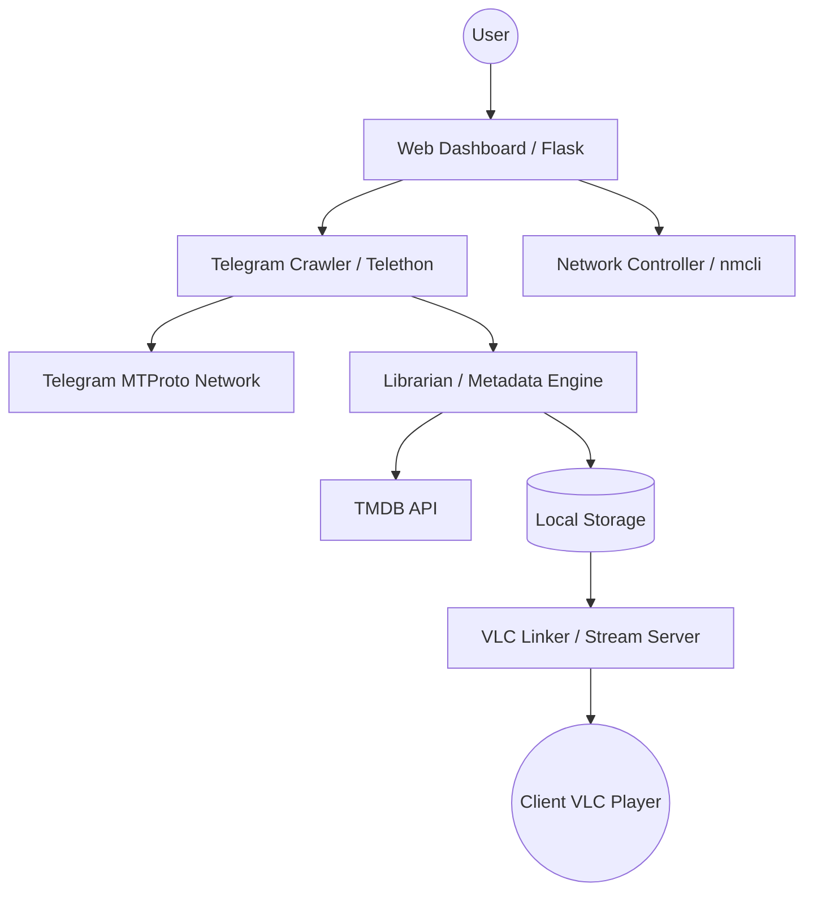

# Conduit: Tele-Media Server (TMS)

A lightweight, self-hosted media ecosystem designed for legacy hardware. **Conduit** (Tele-Media Server) bridges the gap between decentralized Telegram content and your home network, transforming older laptops into powerful, Plex-like media appliances.

---

## 🌟 The Vision
The objective is to repurpose legacy hardware (specifically the **Dell Inspiron 3521**) into a headless, self-contained media server. By utilizing a "Direct Play" strategy and delegating heavy lifting (decoding) to client devices, Conduit ensures smooth 1080p HEVC playback even on Intel Celeron/Ivy Bridge-era hardware.

## 🚀 Key Features

- **Telegram Userbot Crawler**: Automated search and acquisition of media directly from Telegram bots (e.g., iBox, MovieSearchBot) using the Telethon MTProto client.
- **Smart Librarian**: Automatic regex-based filename parsing and metadata enrichment using the **TMDB API**.
- **Headless Network Management**: Programmatic Wi-Fi configuration with an autonomous **Hotspot Fallback** (TMS-Setup) for effortless setup.
- **VLC-Native Streaming**: Bypasses server-side transcoding by generating Universal Deep Links (Android Intents, iOS x-callback, M3U playlists) for native VLC playback on any device.
- **Microservices-Lite Architecture**: Built on a lightweight Python/Flask stack optimized for low 4GB RAM footprints.

---

## 🏗 System Architecture



### Hardware Optimization
| Component | Strategy |
| :--- | :--- |
| **CPU** | **Direct Play Only**. No transcoding to prevent CPU saturation on Ivy Bridge processors. |
| **RAM** | Headless Linux (Debian/Ubuntu) deployment to minimize idle usage to ~400MB. |
| **Network** | Ethernet prioritized; Wi-Fi 4 optimized for bitrates < 40 Mbps. |

---

## 🛠 Prerequisites

- **OS**: Ubuntu Server 24.04 LTS (Recommended) or Debian 12.
- **Hardware**: Dell Inspiron 3521 or similar x86_64 legacy device.
- **API Credentials**:
  - [Telegram API ID & Hash](https://my.telegram.org)
  - [TMDB API Key](https://www.themoviedb.org/documentation/api)

---

## 🔧 Setup & Installation

### 1. System Preparation
```bash
sudo apt update && sudo apt upgrade -y
sudo apt install python3-pip python3-venv ffmpeg network-manager git nginx -y
```

### 2. Application Setup
```bash
# Clone the repository
git clone https://github.com/yowunpansilu/Conduit.git
cd Conduit

# Create environment
python3 -m venv venv
source venv/bin/activate
pip install flask telethon tmdbsimple guessit gunicorn python-dotenv
```

### 3. Configuration
Create a `.env` file in the root:
```env
TG_API_ID=your_id
TG_API_HASH=your_hash
TMDB_API_KEY=your_key
SECRET_KEY=your_secret
DOWNLOAD_DIR=/media/storage/downloads
LIBRARY_DIR=/media/storage/library
```

---

## 📱 Usage Guide

1. **Initial Setup**: If no Wi-Fi is available, connect to the `TMS-Setup` hotspot.
2. **Link Telegram**: Authenticate with your phone number via the Web Dashboard.
3. **Search & Fetch**: Search for titles; the crawler interactively negotiates with Telegram bots.
4. **Play**: Tap "Play in VLC" on your mobile device or open the generated playlist on your PC.

---

## ⚠️ Notes on Performance
- **Avoid Transcoding**: The Dell 3521 *cannot* transcode HEVC in real-time. Always stream to a client capable of native decoding.
- **Security**: The session file contains your Telegram credentials. Ensure the server is only accessible via your local network.

---

## 📄 License
This project is licensed under the MIT License - see the [LICENSE](LICENSE) file for details.
