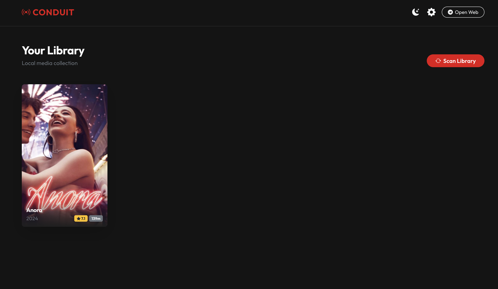
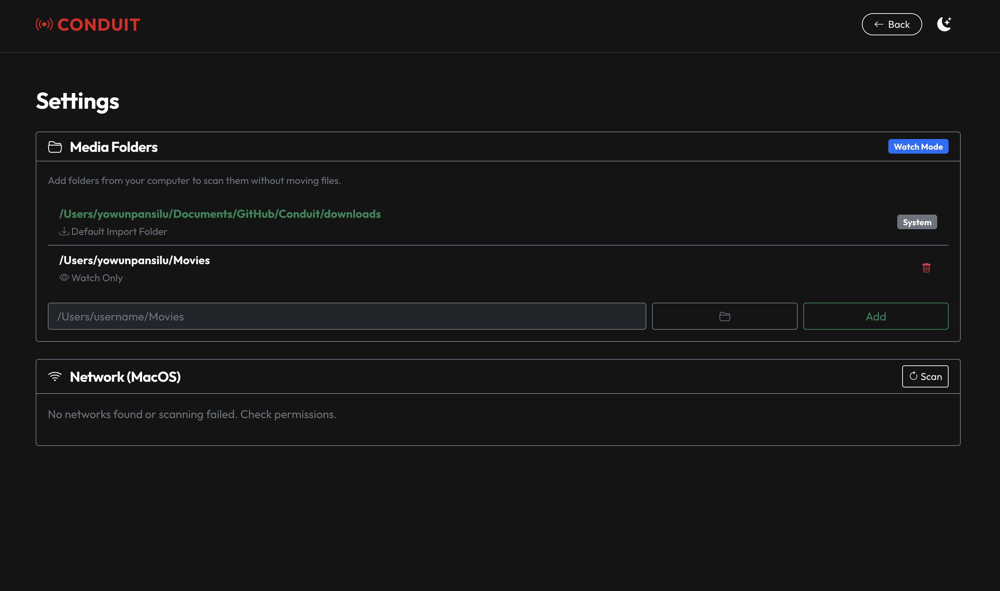

# Conduit: Local Media Server

**Conduit** is a sleek, self-hosted media server that organizes your local video files into a beautiful, Netflix-style library. 

It is designed to be lightweight and simple: point it at your media folders, and it automatically fetches posters, metadata, and descriptions using the TMDB API. It features a modern, responsive dashboard with a premium dark/light mode and simple settings management.




---

## 🚀 Key Features

*   **Librarian Mode**: Automatically scans your `downloads` folder and other manual watch paths to discover movies and TV shows.
*   **Headless Network Management**: Programmatic Wi-Fi configuration with an autonomous **Hotspot Fallback** (TMS-Setup) for effortless setup.
    
*   **VLC-Native Streaming**: Bypasses server-side transcoding by generating Universal Deep Links (Android Intents, iOS x-callback, M3U playlists) for native VLC playback on any device.
*   **Modern Dashboard**: A clean, responsive web interface built with **Flask** and **Bootstrap 5**.
*   **Theme Support**: Toggle between a premium **Dark Mode** and a crisp Light Mode.
*   **Direct Play**: Stream media directly in your browser without complex transcoding (supports HTML5 formats like MP4/MKV).
*   **Wi-Fi Manager (macOS)**: Scan and connect to Wi-Fi networks directly from the Settings page (optimized for headless Mac minis).

---

## 🛠 Prerequisites

*   **Python 3.9+**
*   **TMDB API Key**: Free to get from [The Movie Database](https://www.themoviedb.org/documentation/api).
*   **OS**: macOS (for Wi-Fi features) or Linux/Windows (core features work everywhere).

---

## 🔧 Installation

1.  **Clone the Repository**
    ```bash
    git clone https://github.com/yowunpansilu/Conduit.git
    cd Conduit
    ```

2.  **Create Virtual Environment**
    ```bash
    python3 -m venv venv
    source venv/bin/activate
    ```

3.  **Install Dependencies**
    ```bash
    pip install -r requirements.txt
    ```

4.  **Configuration**
    Create a `.env` file in the root directory:
    ```env
    # Required
    SECRET_KEY=your_random_secret_string
    TMDB_API_KEY=your_tmdb_api_key

    # Optional (Defaults provided)
    DOWNLOAD_DIR=downloads
    ```

5.  **Run the Server**
    ```bash
    python app.py
    ```
    Access the dashboard at `http://localhost:5001`.

---

## 📱 Usage

1.  **Add Media**: Drop video files into the `downloads/` folder, or go to **Settings > Media Folders** and add existing directories from your computer.
2.  **Scan Library**: Click **Scan Library** on the Dashboard. Conduit will identify your files and populate the grid.
3.  **Watch**: Click any poster to view details and start playback.
4.  **Settings**:
    *   **Management**: Add/Remove folders.
    *   **Network**: Connect to Wi-Fi (macOS only).
    *   **Theme**: Toggle Dark/Light mode.

---

## 🏗 System Architecture

**Conduit** uses a simple monolithic architecture optimized for local usage:

*   **Backend**: Flask (Python) handles routing, database interactions, and system commands.
*   **Database**: SQLite (via SQLAlchemy) stores media metadata (`Media`) and configuration (`MediaFolder`).
*   **Frontend**: Jinja2 Templates + Bootstrap 5 + Custom CSS/JS.
*   **Scanning**: `librarian.py` crawls directories & fetches metadata.
*   **Networking**: `wifi_utils.py` interfaces with macOS `airport` and `networksetup` commands.

---

## 📄 License

This project is licensed under the MIT License.
